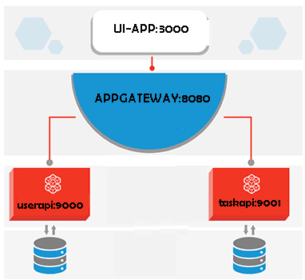

# Nodejs Microservices application to manage users and tasks

# Technologies

- ReactJS
- NodeJs
- ExpressJS
- Redux
- Mongodb
- LernaJS
- http-proxy-middleware
- bootstrap

# already Implemented

- Created two micro services -  User API and Task API Services, api gateway to proxy request, and UI app using reactJs
- Implemented State management in UI app using redux library.
- Integrated lernaJS app to manage app applications
- Easily extensible and scalable approach

# Architecture Diagram

# setup
> `nodejs` and `mongodb` installed on your computer before following the steps below
> Install lerna globally using npm install --global lerna
- Run `git clone https://github.com/intkiran/bsapp.git` to clone the repository and `cd bsapp`.
- Install lerna globally on your computer by running `npm install -g lerna`
- Install all the dependencies in the project by running `npm run bootstrap` from the project root directory in your terminal.
- copy and rename each .env.sample to .env and modify the values accordingly
- Start the user-api services by running `cd user-api && npm run dev` from the root directory.User-API microservices server listens at 9000 
- Start the task-api services by running `cd task-api && npm run dev` from the root directory.User-API microservices server listens at 9001 
- Start the apigateway by running `cd apigateway && npm run start` from the root directory.Apigateway server listens at 8080

- Start the UI APP by running `cd ui-app && npm run start` from the root directory.
- Visit `http://localhost:3000` to access the ui-app.

## Zeit
> zeit Now cli installed on your computer before following the steps below
> Install now cli globally using 'npm i -g now' locally

To deploy the each app with Zeit;
- Create an account or login to your account on Zeit
- Add below environement variables  for user-url,task-url, proxy-url and mongo_url
- Connect Github with Zeit and choose the repository you want to deploy from.
- Once the application has been successfully deployed, visit the auto-generated url to access the client.

# Live Server

Visit `https://ui-api.ikiranbabu.now.sh/` to access the ui-app.

# Author
Kiran Babu
